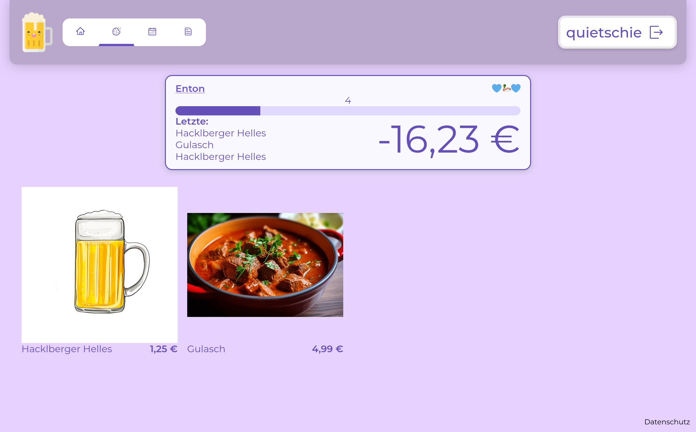

# PRoST

(***P**raktisches **R**echnungssystem für **o**ptimale **S**pesen- und **T**rinkkultur*)

Ein digitales Kaffeekassen-System
der [Fachschaft für Informatik und Mathematik der Universität Passau](https://fsinfo.fim.uni-passau.de/).



## Features

Eine [Feature-Liste](https://github.com/fsinfopassau/PRoST/wiki/Features) mit Nutzungsanleitung ist im [Wiki](https://github.com/fsinfopassau/PRoST/wiki) zu finden 

## Deploy

Details stehen unter [Setup im Wiki](https://github.com/fsinfopassau/PRoST/wiki/Setup)

**Build & Run Compose**:

```bash
docker compose build
```

```bash
docker compose up
```

Die Seite ist unter [localhost/prost](http://localhost/prost) zu finden

## Development

**Frontend**:

- ESLint addon

```bash
cd frontend
npm install
npm run dev
```

Frontend ist unter [localhost:8080](http://localhost:8080) zu finden

**Backend**:

- [Google-Java-Codestyle](https://github.com/google/styleguide/blob/gh-pages/intellij-java-google-style.xml)
    - Intellij: Settings > Editor > Codestyle > Scheme 
  
Run backend-stack:
```bash
docker compose up ldap backend mariadb --build
```